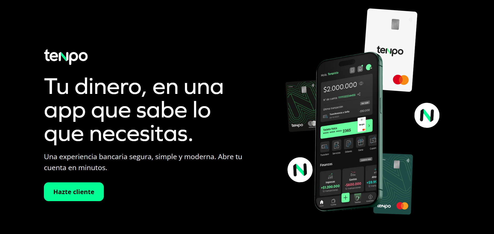

#  💸Landing Page para Tenpo

Este proyecto es una landing page animada y responsiva diseñada para **Tenpo**.



🔗 **Ver demo online**  
👉 [https://fintech-landing-xi.vercel.app](https://fintech-landing-xi.vercel.app)

---

## 🚀 Cómo correr el proyecto en local

Si quieres probarlo localmente, sigue estos pasos:

```bash
git clone https://github.com/tu-usuario/fintech-landing.git
cd fintech-landing
npm install
npm run dev
````` 
Abre [http://localhost:5173](http://localhost:5173) y ya puedes verlo andando.

Este proyecto usa **Vite** para un arranque más rápido y eficiente.

## 🔧 Herramientas y librerías utilizadas

| Herramienta       | Uso principal                                           |
|-------------------|---------------------------------------------------------|
| **React**         | Framework principal para construir la UI               |
| **Vite**          | Entorno de desarrollo moderno y veloz                  |
| **Tailwind CSS**  | Framework de estilos                                   |
| **Framer Motion** | Animaciones en scroll, entradas y modales              |
| **React Icons**   | Íconos vectoriales                                     |

---

## 🎨 Decisiones de diseño

- **Visual storytelling**: El diseño comunica la estética de Tenpo a primera vista.
- **Animaciones scroll-parallax**: Agregan dinamismo sin sobrecargar la experiencia.
- **Modal desde tarjeta**: El modal se expande desde la tarjeta para reforzar la interacción directa.
- **Soporte visible**: El botón flotante de ayuda refleja accesibilidad y asistencia digital.
- **Mobile-first**: Todo el diseño fue creado desde mobile hacia desktop.

---

## 📁 Estructura del proyecto

src/
├── assets/ 
├── components/ 
├── data/
├── App.jsx 
└── main.jsx 

## 🙋‍♀️ Desarrollado por

**Constanza Ramos**  
Frontend Developer | Marketing Digital 
📫 [https://www.linkedin.com/in/constanzaramos/](https://www.linkedin.com/in/constanzaramos/)
